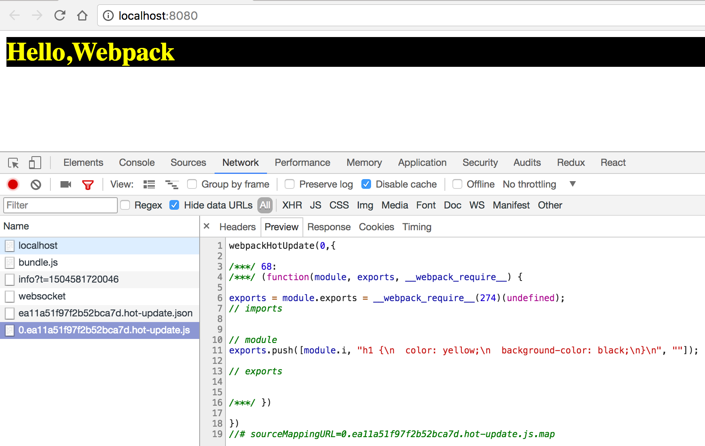

### 开启模块热替换
除了刷新整个网页外，DevServer 还支持一种叫做模块热替换( Hot Module Replacement )的技术可在不刷新整个网页的情况下做到超灵敏的实时预览。
原理是当一个源码发生变化时，只重新编译发生变化的模块，再用新输出的模块替换掉浏览器中对应的老模块。

模块热替换技术的优势有：

- 实时预览反应更快，等待时间更短。
- 不刷新浏览器能保留当前网页的状态，例如在使用 Redux 来管理数据的应用中搭配模块热替换能做到代码更新时 Redux 中的数据还保持不变。

总的来说模块热替换技术很大程度上的提高了开发效率和体验。

#### 模块热替换的原理
模块热替换的原理和自动刷新原理类似，都需要往要开发的网页中注入一个代理客户端用于连接 DevServer 和网页，
不同在于模块热替换独特的模块替换机制。

DevServer 默认不会开启模块热替换模式，要开启该模式，只需在启动时带上参数 `--hot`，完整命令是 `webpack-dev-server --hot`，启动后日志如下：
```
> webpack-dev-server --hot

Project is running at http://localhost:8080/
webpack output is served from /
webpack: wait until bundle finished: /
webpack: wait until bundle finished: /bundle.js
Hash: fe62ac6b753c1d98961b
Version: webpack 3.5.5
Time: 3563ms
        Asset     Size  Chunks                    Chunk Names
    bundle.js  1.11 MB       0  [emitted]  [big]  main
bundle.js.map  1.33 MB       0  [emitted]         main
  [50] (webpack)/hot/log.js 1.04 kB {0} [built]
 [118] multi (webpack)-dev-server/client?http://localhost:8080 webpack/hot/dev-server ./main.js 52 bytes {0} [built]
 [119] (webpack)-dev-server/client?http://localhost:8080 5.83 kB {0} [built]
 [120] ./node_modules/url/url.js 23.3 kB {0} [built]
 [126] ./node_modules/strip-ansi/index.js 161 bytes {0} [built]
 [128] ./node_modules/loglevel/lib/loglevel.js 6.74 kB {0} [built]
 [129] (webpack)-dev-server/client/socket.js 856 bytes {0} [built]
 [161] (webpack)-dev-server/client/overlay.js 3.6 kB {0} [built]
 [166] (webpack)/hot nonrecursive ^\.\/log$ 170 bytes {0} [built]
 [168] (webpack)/hot/dev-server.js 1.61 kB {0} [built]
 [169] (webpack)/hot/log-apply-result.js 1.31 kB {0} [built]
 [170] ./main.js 2.35 kB {0} [built]
 [171] ./node_modules/react/react.js 56 bytes {0} [built]
 [187] ./node_modules/react-dom/index.js 59 bytes {0} [built]
 [273] ./main.css 993 bytes {0} [built]
    + 262 hidden modules
webpack: Compiled successfully.
```
可以看出 `bundle.js` 代理客户端相关的代码包含六个文件：
```
 [119] (webpack)-dev-server/client?http://localhost:8080 5.83 kB {0} [built]
 [129] (webpack)-dev-server/client/socket.js 856 bytes {0} [built]
 [161] (webpack)-dev-server/client/overlay.js 3.6 kB {0} [built]
 [166] (webpack)/hot nonrecursive ^\.\/log$ 170 bytes {0} [built]
 [168] (webpack)/hot/dev-server.js 1.61 kB {0} [built]
 [169] (webpack)/hot/log-apply-result.js 1.31 kB {0} [built]
```
相比于自动刷新的代理客户端，多出了后三个用于模块热替换的文件，也就是说代理客户端更大了。

修改源码 `main.css` 文件后，新输出了如下日志：
```
webpack: Compiling...
Hash: 18f81c959118f6230623
Version: webpack 3.5.5
Time: 551ms
                                   Asset       Size  Chunks                    Chunk Names
                               bundle.js    1.11 MB       0  [emitted]  [big]  main
    0.ea11a51f97f2b52bca7d.hot-update.js  353 bytes       0  [emitted]         main
    ea11a51f97f2b52bca7d.hot-update.json   43 bytes          [emitted]         
                           bundle.js.map    1.33 MB       0  [emitted]         main
0.ea11a51f97f2b52bca7d.hot-update.js.map  577 bytes       0  [emitted]         main
  [68] ./node_modules/css-loader!./main.css 217 bytes {0} [built]
 [166] (webpack)/hot nonrecursive ^\.\/log$ 170 bytes {0} [built]
    + 275 hidden modules
webpack: Compiled successfully.
```
DevServer 新生成了一个用于替换老模块的布丁文件 `0.ea11a51f97f2b52bca7d.hot-update.js`，同时在浏览器开发工具中也能看到抓包：



可见补丁中包含了 `main.css` 文件新编译出来 CSS 代码，网页中的样式也立刻变成了源码中描述的那样。

> 请不要把模块热替换技术用于线上环境，
